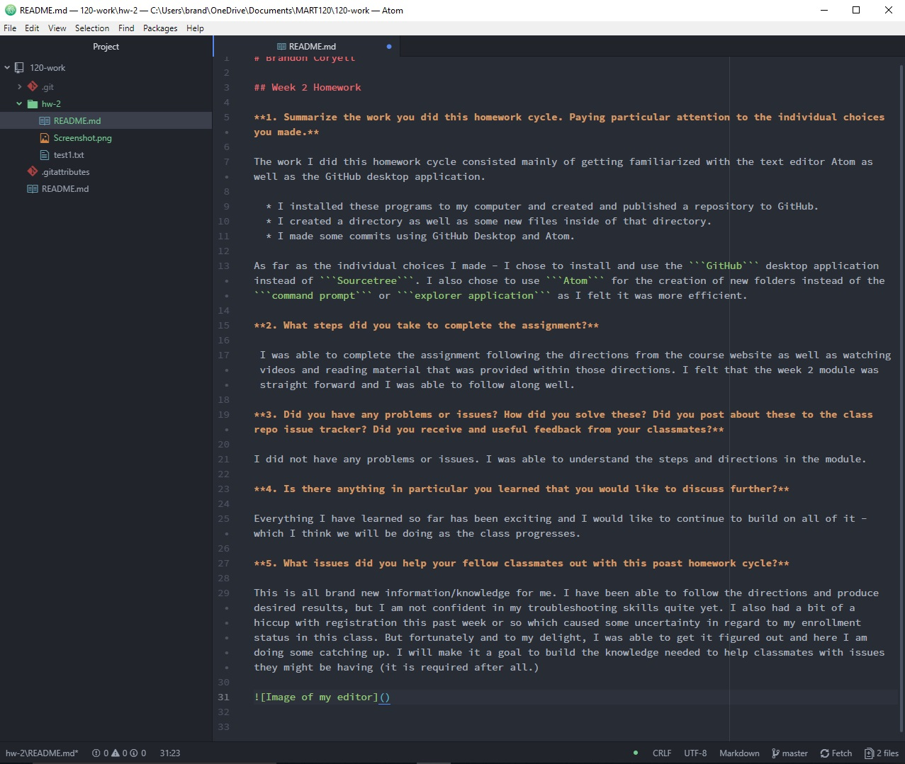

# Brandon Coryell

## Week 2 Homework

**1. Summarize the work you did this homework cycle. Paying particular attention to the individual choices you made.**

The work I did this homework cycle consisted mainly of getting familiarized with the text editor Atom as well as the GitHub desktop application.

  * I installed these programs to my computer and created and published a repository to GitHub.
  * I created a directory as well as some new files inside of that directory.
  * I made some commits using GitHub Desktop and Atom.

As far as the individual choices I made - I chose to install and use the ```GitHub``` desktop application instead of ```Sourcetree```. I also chose to use ```Atom``` for the creation of new folders instead of the ```command prompt``` or ```explorer application``` as I felt it was more efficient.

**2. What steps did you take to complete the assignment?**

 I was able to complete the assignment following the directions from the course website as well as watching videos and reading material that was provided within those directions. I felt that the week 2 module was straight forward and I was able to follow along well.

**3. Did you have any problems or issues? How did you solve these? Did you post about these to the class repo issue tracker? Did you receive and useful feedback from your classmates?**

I did not have any problems or issues. I was able to understand the steps and directions in the module.

**4. Is there anything in particular you learned that you would like to discuss further?**

Everything I have learned so far has been exciting and I would like to continue to build on all of it - which I think we will be doing as the class progresses. 

**5. What issues did you help your fellow classmates out with this poast homework cycle?**

This is all brand new information/knowledge for me. I have been able to follow the directions and produce desired results, but I am not confident in my troubleshooting skills quite yet. I also had a bit of a hiccup with registration this past week or so which caused some uncertainty in regard to my enrollment status in this class. But fortunately and to my delight, I was able to get it figured out and here I am doing some catching up. I will make it a goal to build the knowledge needed to help classmates with issues they might be having (it is required after all.)


